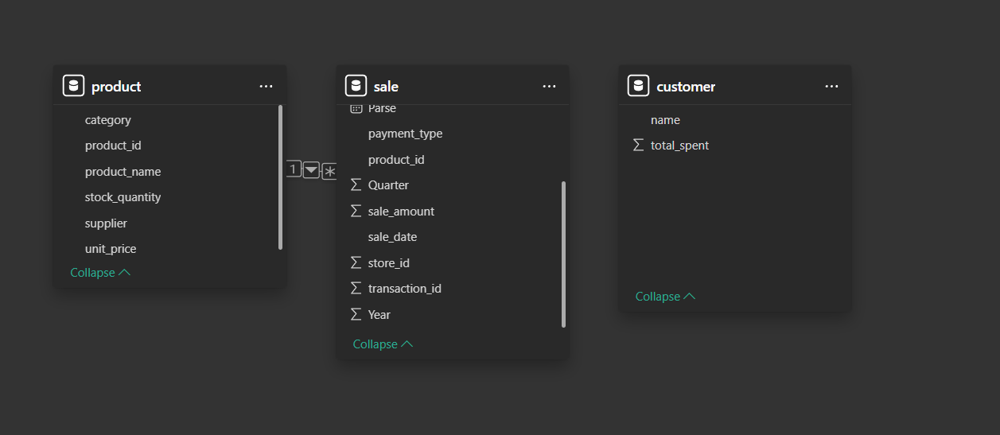
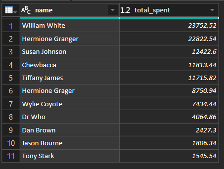
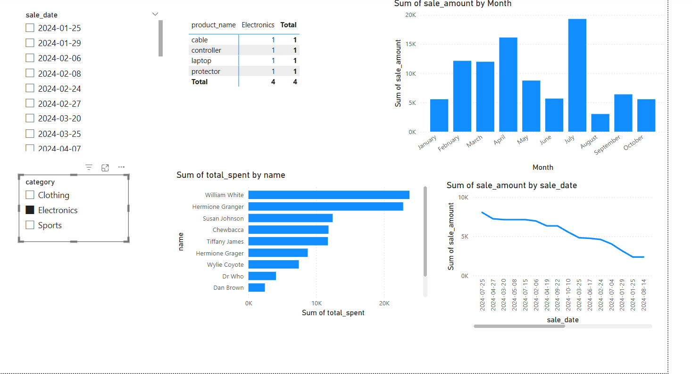
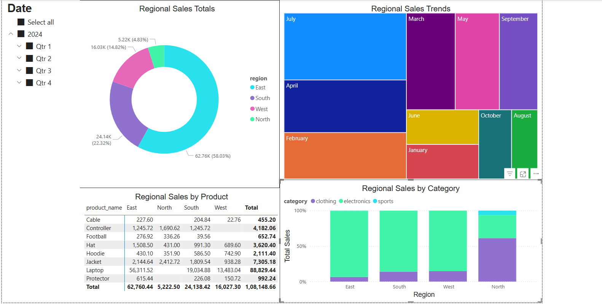

# smart-store-karto
BI and Analytics Project

## Project Setup
### 1. Create a Repository in GitHub
1. Name repository smart-store-karto.
2. Make sure Public is selected.
3. Make sure to add README.md.
4. Create repository.

### 2. Clone Repo to Local
1. Copy URL to the GitHub Repository.
2. Open a terminal in the root (Project) folder.
3. Enter into terminal:
```
git clone (paste URL)
```
4. Check that everything cloned as expected.

### 3. Create .gitignore and requirements.txt
1. Create new file in root project folder named: `.gitignore`
2. Create new file in root project folder named: `requirements.txt`
3. Find `.gitignore` file in course repo and copy/paste into local `.gitignore`
4. Find `requirements.txt` file in course repo and copy/paste into local `requirements.txt`

### 4. Git Add/Commit/Push
```
git add .
git commit -m "Add comment"
git push
```

### 5. Create Virtual Environment
1. From the root project folder:
```
py -m venv .venv
```
2. Accept VS Code suggestions.

### 6. Activate Virtual Environment
```
.venv\Scripts\activate
```

### 7. Install Dependencies
1. Verify .venv is activated (will have a green .venv in terminal)
2. Enter the following commands in PowerShell:
```
py -m pip install --upgrade pip setuptools wheel
py -m pip install -r requirements.txt
```

### 8. Select VS Code Interperter
1. Open the Command Pallette: `Ctrl+Shift+P`
2. Search for "Python: Select Interpreter"
3. Select local .venv option
4. Restart terminal
5. Activate .venv

### 9. Create Folders
1. data
   - raw
   - prepared
2. scripts
3. utils

### 10. Download Data Files
Find raw data .csv files in course repo and download to data\raw folder
- customers_data.csv
- products_data.csv
- sales_data.csv

### 11. Download and Install Power BI

### 12. Create logger.py and data_prep.py
1. Create `logger.py` file under utils folder
2. Find `logger.py` file in course repo and copy/paste contents into local `logger.py`
3. Create `data_prep.py` file under scripts folder
4. Find `data_prep.py` file under `smart-sales-starter-files` repo and copy/paste nto local `data_prep.py`
5. Execute Python script:
```
py scripts\data_prep.py
```
### 13. Prepare Data for ETL

#### Run test script with data scrubber
```
py tests\test_data_scrubber.py
```

#### Finally running it on our data
```
py scripts\data_prep.py
```

## 14. Data Warehouse (DW) Creation and Data Upload

### 14.1 Create and Configure SQLite Database
1. The SQLite database `smart_sales.db` is created in the `data/dw/` directory.
2. The schema includes the following tables:
   - `customer`
   - `product`
   - `sale`

### 14.2 Database Schema

#### **customer Table**
| Column Name       | Data Type  | Description                          |
|------------------|-----------|--------------------------------------|
| `customer_id`   | INTEGER (PK) | Unique ID for each customer |
| `name`          | TEXT       | Customer's full name |
| `region`        | TEXT       | Region of the customer |
| `join_date`     | TEXT       | Customer's sign-up date |
| `loyalty_points` | INTEGER    | Loyalty points accumulated |
| `customer_segment` | TEXT       | Customer segment (Bronze, Silver, Gold) |
| `standard_datetime` | TEXT       | Standardized join date |

#### **product Table**
| Column Name     | Data Type  | Description                     |
|----------------|-----------|---------------------------------|
| `product_id`   | INTEGER (PK) | Unique ID for each product |
| `product_name` | TEXT       | Name of the product |
| `category`     | TEXT       | Product category (Electronics, Clothing, etc.) |
| `unit_price`   | REAL       | Price per unit |
| `stock_quantity` | INTEGER    | Available stock count |
| `supplier`     | TEXT       | Supplier name |

#### **sale Table**
| Column Name       | Data Type  | Description                              |
|------------------|-----------|------------------------------------------|
| `sale_id`       | INTEGER (PK) | Unique sale transaction ID |
| `customer_id`   | INTEGER (FK) | ID of the customer making the purchase |
| `product_id`    | INTEGER (FK) | ID of the product sold |
| `sale_amount`   | REAL       | Sale amount after discount |
| `date`         | TEXT       | Date of sale |
| `store_id`     | INTEGER    | Store where the sale occurred |
| `campaign_id`  | INTEGER    | Marketing campaign ID if applicable |
| `discount_percent` | REAL  | Discount applied to the sale |
| `payment_type` | TEXT       | Payment method used (Credit, Debit, PayPal) |

### 14.3 Load Data into the Data Warehouse
1. Prepared data files are loaded into the SQLite database using `etl_to_dw.py`:
   ```sh
   python scripts/etl_to_dw.py


### 15 Power BI Sales Dashboard Report
## 1. Transformed customer table using query
   ```
   SELECT c.name, SUM(s.sale_amount) AS total_spent
     FROM sale s
     JOIN customer c ON s.customer_id = c.customer_id
     GROUP BY c.name
     ORDER BY total_spent DESC;
   ```
## 2. Dashboard Design Choices
- Bar chart to show top customers by total spent.
- Line chart to track sales trends by year → quarter → month.
- Slicer for product category to filter across visuals.
- Drilldown enabled on time axis for multi-level analysis.

## 3. Power BI Data Model View


## 4. Power BI Query Result


## 5. Power BI Final Dashboard



## Module 6 – OLAP Sales Analytics

### 1. Project Objective
The main aim of this analysis is to uncover sales patterns by geographic region and product category to better understand market performance.

### 2. Data Overview
The data comes from a data warehouse accessed via an ODBC connection, along with a previously generated OLAP cube file.

- **From the Data Warehouse (Product Table):**  
  `product_name`, `category`

- **From the OLAP Cube:**  
  `month`, `region`, `sale_amount_sum`

### 3. Tools
Power BI was chosen to explore advanced data visualization and OLAP capabilities, offering a hands-on learning experience with business intelligence tools.

### 4. Workflow & Logic

- **Key Dimensions:**
  - **Category:** Represents high-level grouping of products  
  - **Product Name:** Specific items being analyzed
  - **Region:** Area where the sale occurred  
  - **Time:** Implemented using a date hierarchy including Year, Quarter, and Month  

- **Measures and Metrics:**
  - **Total Sales:** Computed using the sum of `sale_amount_sum`

- **OLAP Techniques in Action:**
  - **Slicing:** Applied to isolate specific time periods  
  - **Dicing:** Used to zoom into combinations like Product vs. Region  
  - **Drilldowns:** Enabled through hierarchical time data to allow deeper insight

- **Underlying Logic:**
  - Data is modeled with dimensions tied to Region, Time, Product, and Category  
  - Hierarchical date structures allow flexible exploration over time  
  - Filters and groups help evaluate sales performance across locations and product types

### 5. Results

- **Donut Chart – Sales Distribution by Region**
  - **Insight:** The East dominates with more than half of the total sales.  
  - **Observation:** North has minimal impact (<5%), while South and West contribute 22% and 15%, respectively.

- **Treemap – Monthly Regional Trends**
  - **Insight:** South and West exhibit parallel growth patterns.  
  - **Observation:** North sees a sharp drop in May and recovers in summer.

- **Matrix – Product Performance by Region**
  - **Insight:** Laptops lead sales in regions where available.  
  - **Observation:** Cables are the least popular across all regions.

- **Stacked Column Chart – Sales by Category and Region**
  - **Insight:** Electronics lead most regions, while Clothing dominates in the North.  
  - **Observation:** Sports products perform poorly in every region.



### 6. Suggested Business Action

- Increase investment in the East, which is the top-performing region.
- Reassess strategy in the North boost awareness or promotions.
- Prepare for seasonal fluctuations in the North by reinforcing mid-year campaigns.
- Align marketing and inventory for the South and West, as their patterns are similar.
- Highlight strong products like laptops in future bundles or campaigns.
- Evaluate the future of low-performing items such as football and cables.

### 7. Challenges

Some with Power BI, but overall everything is good